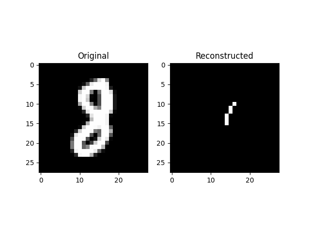
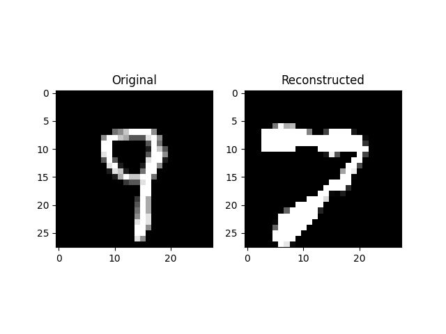
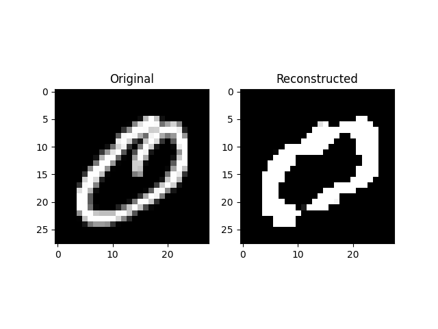
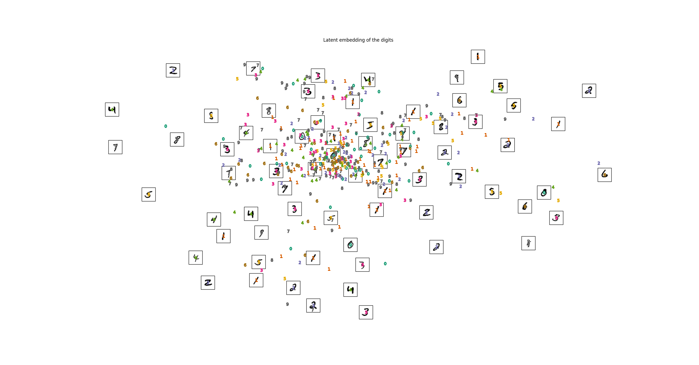
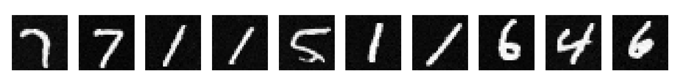
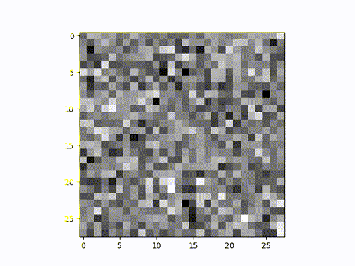

# VAE (and DDPM) Example

Project for Probabilistic Machine Learning

## Report

We write a paper describing image generation models and from a probabilistic perspective, which can be found in report.pdf. We cover the math behind variational autoencoders and diffusion models and explain the connection between the two.

## Installation

```pip3 install torch torchvision matplotlib scikit-learn```

## Usage

To re-train the VAE, run the following:
```python3 main_vae.py --latent_dim 2 --save_name sample_1_latents --latents_to_sample 1```
Then, add the flags `--viz_latent` to visualize the latent space and `--case_study` to visualize the reconstructions.

To re-train the DDPM, run the following:
```python3 main_ddpm.py --n_steps 1000```
Then, add the flags `--viz_trajectory` to save images of the trajectory of a single sample and `--case_study` to visualize the reconstructions.

Once you have the trajectory images, you can create a video with the following command:
```ffmpeg -framerate 120 -pattern_type glob -i '*.png' -r 15 -vf scale=512:-1 ddpm_trajectory.gif;```

## Results

### VAE Generations

Figure 2 in the report.

| Degenerate | Miss | Success |
| --- | --- | --- |
 |  | 

### VAE Latent space



### DDPM Generations

Figure 3 in the report.



### DDPM Trajectory




As mentioned in the code, we thank the authors of `https://github.com/cloneofsimo/minDiffusion` for their implementation of DDPM.
